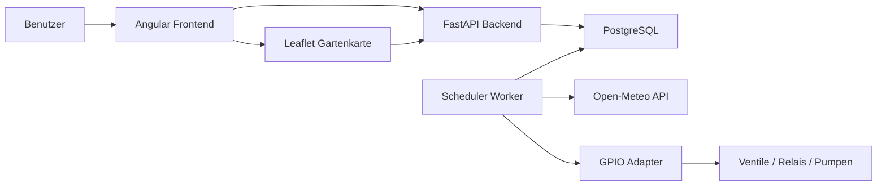
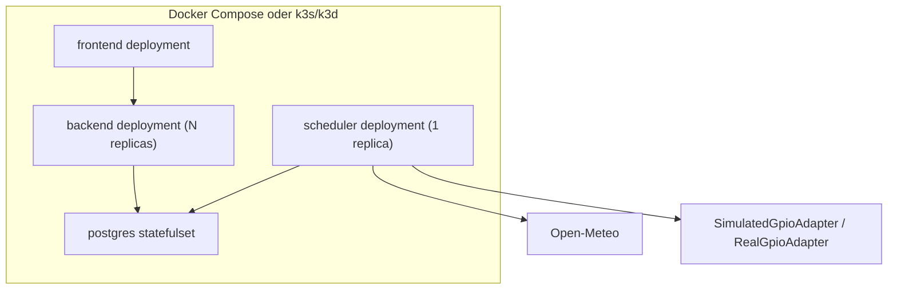
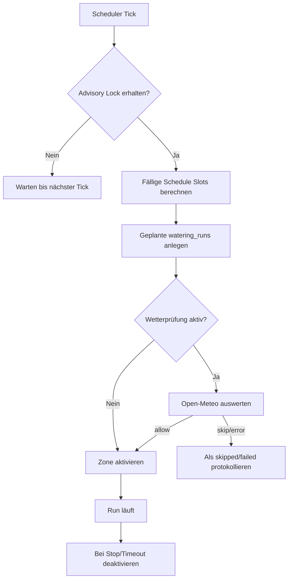
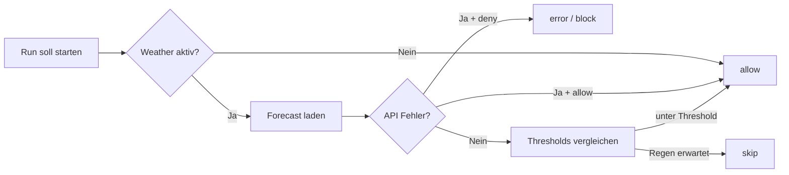
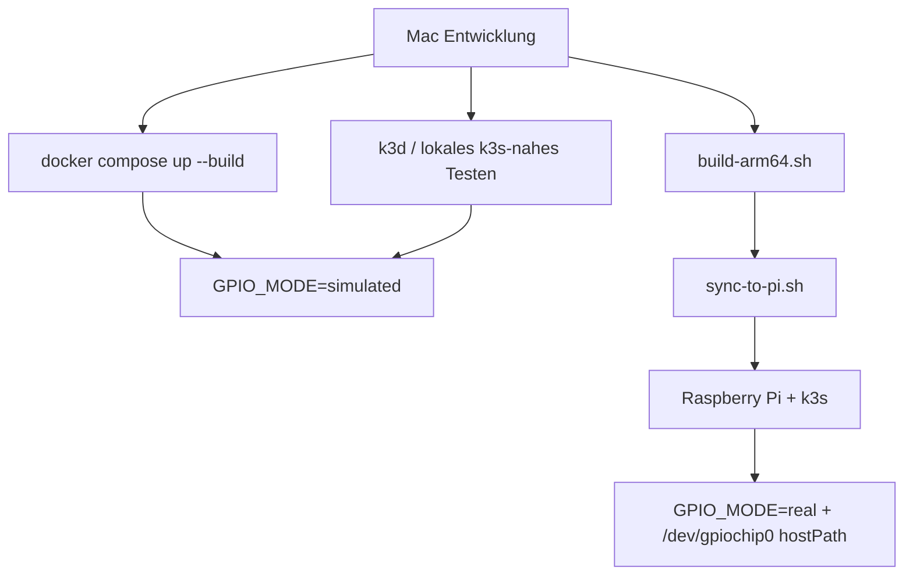

# Irrigation Control for Raspberry Pi and k3s

Eine wartbar strukturierte Bewässerungssteuerung mit FastAPI, Angular, PostgreSQL, Docker und Kubernetes/k3s. Das Projekt ist so aufgebaut, dass du lokal auf dem Mac mit Simulation entwickeln kannst und später dieselben Container- und Kubernetes-Prinzipien auf einem Raspberry Pi mit k3s weiterverwendest.

## Architektur

Die Architektur trennt API, Scheduler und Hardwarezugriff bewusst:

- `backend`: FastAPI-API für Zonen, Zeitpläne, Historie, Einstellungen und Not-Aus.
- `scheduler`: eigenständiger Worker-Prozess, der fällige Jobs plant, Weather-Checks ausführt und allein GPIO-seitig schreibt.
- `frontend`: Angular-Standalone-App für Dashboard, Zonen, Zeitpläne, Historie, Konfiguration und interaktive Gartenkarte.
- `postgres`: zentrale Persistenz für Zonen, Zeitpläne, Läufe, Wetterentscheidungen und globale Einstellungen.

Wichtig: Das API-Backend ist horizontal skalierbar. Scheduler und GPIO-Schreibzugriff laufen nur einmal. Zusätzlich schützt ein PostgreSQL-Advisory-Lock vor doppelter Job-Ausführung.

## Mermaid

### System Context



### Container Overview



### Scheduling Flow



### Weather Decision Flow



### Deployment Mac vs Raspberry Pi



## Repository-Struktur

```text
backend/
frontend/
k8s/
scripts/
docker-compose.yml
README.md
```

## Backend

- FastAPI mit OpenAPI, `/health/live` und `/health/ready`
- SQLAlchemy + Alembic
- Hexagonal angelegt über `application`, `domain` und `infrastructure`
- `SimulatedGpioAdapter` für Mac und `RealGpioAdapter` als vorbereiteter Platzhalter für `libgpiod`
- Safety-Regeln:
  - Maximaldauer pro Zone wird erzwungen
  - Scheduler setzt beim Start alle Zonen auf OFF
  - Bei Scheduler-Fehlern werden alle aktiven Zonen gestoppt
  - Not-Aus API: `POST /api/watering/stop-all`

## Frontend

- Angular Standalone Components
- Bereiche:
  - Dashboard
  - Zonen
  - Zeitpläne
  - Historie
  - Konfiguration
  - Gartenkarte mit Leaflet Simple CRS, Bild-Overlay und Polygon-Zeichnen

### Interaktive Gartenkarte

Die Gartenkarte ist für lokale Bildkoordinaten ausgelegt und braucht keine echten GPS-Koordinaten. Im Frontend wird Leaflet mit `CRS.Simple` verwendet, damit du ein Gartenbild als statischen Hintergrund laden und darauf Zonen als Polygone einzeichnen kannst.

Vorhandene Funktionen:

- Gartenkarte anlegen, bearbeiten und löschen
- Gartenbild per `image_url` als Hintergrund laden
- Polygone für Zonen zeichnen, bearbeiten und löschen
- Zuordnung eines Polygons zu genau einer Zone
- Farbcodierte Zustände direkt auf der Karte:
  - grau = deaktiviert
  - grün = aktiv
  - blau = läuft gerade
  - orange = in den nächsten 12 Stunden geplant
  - rot = letzter Lauf fehlgeschlagen
- Klick auf eine Fläche zeigt:
  - Zonenname
  - Status
  - nächste Bewässerung
  - letzte Bewässerung
  - Wetterabhängigkeit
  - Aktionen für Start, Stop und Wechsel zur Zeitplanverwaltung

API-Endpunkte für die Kartenfunktion:

- `GET /api/maps`
- `POST /api/maps`
- `PUT /api/maps/{map_id}`
- `DELETE /api/maps/{map_id}`
- `GET /api/maps/{map_id}/view`
- `POST /api/maps/shapes`
- `PUT /api/maps/shapes/{shape_id}`
- `DELETE /api/maps/shapes/{shape_id}`

## Lokale Entwicklung auf dem Mac

### Voraussetzungen

- Docker Desktop
- optional: `kubectl`, `k3d`

### Start mit Docker Compose

```bash
cp .env.example .env
docker compose up --build
```

Danach:

- Frontend: `http://localhost:8080`
- Backend API: `http://localhost:8000`
- OpenAPI: `http://localhost:8000/docs`
- Postgres: `localhost:5432`

Die Gartenkarte erreichst du im Frontend über den Menüpunkt `Gartenkarte`. Für einen schnellen Start kannst du zuerst eine Karte mit Bild-URL und Größe anlegen und danach Polygone für bestehende Zonen einzeichnen.

### Simulation

Auf dem Mac läuft die Anwendung mit `GPIO_MODE=simulated`. GPIO-Aktionen werden geloggt und die resultierenden Läufe sind in `watering_runs` und `weather_decisions` nachvollziehbar.

## Lokales Kubernetes mit k3d

Das Projekt ist so angelegt, dass die gleiche Trennung wie auf dem Pi gilt: API mehrfach, Scheduler einmal, Postgres persistent.

```bash
./scripts/deploy-local-k3d.sh
```

Hinweis: Für ein echtes lokales k3d-Deployment müssen die Docker-Images im Cluster verfügbar sein. Das ist derselbe image-basierte Weg, den du später auch auf dem Pi brauchst. Der lokale Scheduler nutzt bewusst `GPIO_MODE=simulated` ohne Device-Mount. Auf dem Pi kommt stattdessen das Pi-spezifische Scheduler-Manifest mit `/dev/gpiochip0` dazu.

## Deployment auf Raspberry Pi mit k3s

### 1. ARM64 Images bauen

```bash
./scripts/build-arm64.sh
```

### 2. Projekt auf den Pi synchronisieren

```bash
./scripts/sync-to-pi.sh pi@<PI_HOST>
```

### 3. Auf dem Pi deployen

```bash
./scripts/deploy-pi.sh
```

Das Pi-Deployment nutzt bewusst die Pi-spezifischen Manifeste:

- `k8s/backend-deployment-pi.yaml`
- `k8s/scheduler-deployment-pi.yaml`

Dabei gilt auf dem Pi:

- `backend` läuft mit `replicas: 1`, damit der kleine Knoten stabil bleibt
- `scheduler` läuft mit `replicas: 1`
- das Backend nutzt eine `startupProbe` und großzügigere Health-Probes, damit der API-Server nach Reboots oder auf langsamerem ARM-Storage sauber hochkommt

Vor dem Pi-Deployment:

- `.env` mit echtem `POSTGRES_PASSWORD` anlegen
- optional `OPENAI_API_KEY` als Kubernetes-Secret setzen, damit der KI-Zonenassistent die ChatGPT API nutzt; ohne Key fällt das Backend auf die lokale fachliche Vorschlagslogik zurück
- optional `k8s/secret.example.yaml` als Vorlage ansehen, aber nicht direkt verwenden
- Images auf dem Pi oder in einer erreichbaren Registry bereitstellen

### 4. Feste IP auf dem Pi

Der verifizierte Pi-Betrieb in diesem Projekt nutzt eine feste WLAN-IP:

- Pi-IP: `192.168.178.193`
- Gateway: `192.168.178.1`
- DNS: `192.168.178.1`, `1.1.1.1`
- WLAN: `WLAN-Y23TGM`

Die feste IP wurde über `NetworkManager` auf dem Pi gesetzt. Wenn du sie auf einem anderen Netz übernimmst, passe mindestens diese Werte an:

- `ipv4.addresses`
- `ipv4.gateway`
- `ipv4.dns`
- SSID/WLAN-Profil

### 5. Zugriff im Heimnetz

Nach dem erfolgreichen Pi-Deployment ist SmartGarden direkt über die Pi-IP erreichbar:

- Frontend: `http://192.168.178.193/`
- API Runtime: `http://192.168.178.193/api/runtime`

Zusätzlich bleiben die Host-basierten Ingress-Regeln erhalten:

- `frontend.irrigation.local`
- `api.irrigation.local`

### 6. Autostart und Reboot-Verhalten

Der Pi-Stack läuft im Autostart über `k3s`.

Verifiziert wurde:

- `systemctl is-enabled k3s` → `enabled`
- nach einem echten Reboot kommt der Pi wieder unter `192.168.178.193` hoch
- `backend`, `frontend`, `postgres` und `scheduler` starten danach automatisch wieder

Praktische Prüfkommandos auf dem Pi:

```bash
systemctl is-active k3s
sudo kubectl -n irrigation get pods
curl -I http://127.0.0.1/
curl http://127.0.0.1/api/runtime
```

### 7. Automatisches Deployment nach grüner CI

GitHub Actions führt Backend-Tests, Frontend-Build und Frontend-Unit-Tests für jeden Branch aus. Der Pi pollt danach GitHub und deployt nur Commits, deren Checks grün sind.

Einmalig auf dem Pi:

```bash
sudo apt-get update
sudo apt-get install -y docker.io
sudo usermod -aG docker pi
cd /home/pi/SmartGarden
SMARTGARDEN_AUTO_DEPLOY_BRANCH=main bash scripts/install-pi-auto-deploy.sh
```

Der Timer deployt automatisch den konfigurierten Hauptbranch. Feature-Branches werden nicht automatisch deployt. Bei Bedarf manuell auf dem Pi:

```bash
cd /home/pi/SmartGarden
bash scripts/pi-deploy-branch.sh ai
```

Auch dieser manuelle Feature-Deploy bricht ab, wenn die GitHub-CI für den Branch-Commit nicht grün ist.

## GPIO-Hinweise

- Lokal: `GPIO_MODE=simulated`
- Pi: `GPIO_MODE=real`
- Für den Pi ist in `k8s/scheduler-deployment-pi.yaml` ein `hostPath` für `/dev/gpiochip0` vorbereitet.
- Der `RealGpioAdapter` ist absichtlich nur vorbereitet. Für echte Hardware musst du dort die `libgpiod`-Ansteuerung ergänzen.

## Wetter-API

- Verwendet: [Open-Meteo](https://open-meteo.com/)
- Kein API-Key nötig
- Entscheidung wird je Lauf historisiert
- Fehlerverhalten konfigurierbar:
  - `allow`
  - `deny`

## Datenbankmigrationen

Migrationen laufen lokal und im Cluster über:

```bash
alembic upgrade head
```

Tabellen:

- `zones`
- `schedules`
- `watering_runs`
- `weather_decisions`
- `app_settings`
- `garden_maps`
- `zone_map_shapes`

## Backup-Hinweis

Für den Pi-Betrieb solltest du regelmäßige Postgres-Backups einplanen, zum Beispiel per `pg_dump` auf ein externes Volume oder NAS. Im StatefulSet ist Persistenz nur die erste Schutzschicht, kein Backup.

## Troubleshooting

- Wenn keine Bewässerungen starten, prüfe zuerst `scheduler`-Logs.
- Wenn Läufe mehrfach auftauchen, prüfe Scheduler-Replica-Anzahl und Advisory-Lock-Konfiguration.
- Wenn Open-Meteo nicht erreichbar ist, greift `WEATHER_FAIL_MODE`.
- Wenn du auf dem Pi echte GPIOs nutzt, teste zuerst mit genau einer Zone und Hardware ohne Wasserlast.

## Sinnvolle nächste Schritte

1. `RealGpioAdapter` mit echter `libgpiod`-Ansteuerung implementieren.
2. Optionale Authentifizierung vor die API setzen.
3. DB-Integrationstests per Compose ergänzen.
4. Image-Registry-Workflow für Pi/k3s ergänzen.
5. Optional dedizierten GPIO-Controller-Prozess aus dem Scheduler herauslösen, falls später komplexere Hardwarelogik nötig wird.
