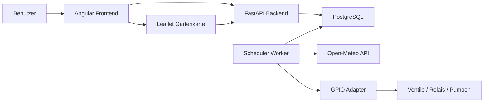
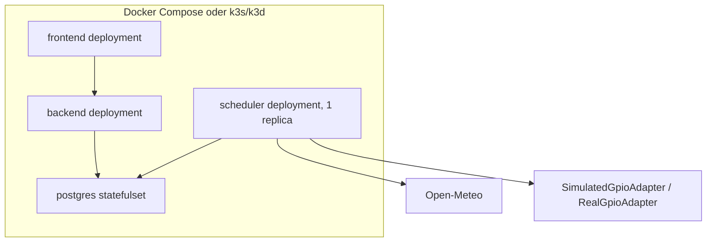
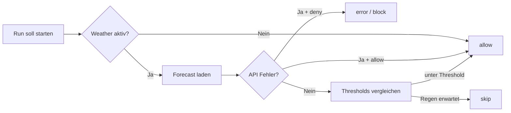

# SmartGarden

[](https://github.com/philippgri11/SmartGarden/actions/workflows/ci.yml)
[](https://github.com/philippgri11/SmartGarden/actions/workflows/ci.yml)
[](https://github.com/philippgri11/SmartGarden/actions/workflows/ci.yml)
[](LICENSE)
[](frontend)
[](backend)
[](docker-compose.yml)
[](k8s)
[](README.md#raspberry-pi-und-echte-hardware)
[](https://paypal.me/phGrill)

SmartGarden ist eine offene Bewaesserungssteuerung fuer DIY-Home-Projekte: Raspberry Pi, Relais, Ventile, Wetterdaten, Web-Dashboard und eine interaktive Gartenkarte in einem sauber strukturierten Stack.

Das Projekt ist fuer Menschen gedacht, die ihre Terrasse, Hochbeete, Balkonpflanzen oder den ganzen Garten selbst automatisieren wollen, ohne sich in einer geschlossenen Smart-Home-Cloud einzusperren. Lokal laeuft alles in Simulation, auf dem Raspberry Pi kann dieselbe Architektur spaeter echte GPIO-Hardware steuern.

## Highlights

- Web-Dashboard fuer Zonen, Zeitplaene, Historie, Einstellungen und Not-Aus
- Interaktive Gartenkarte mit Bild-Overlay und gezeichneten Bewaesserungsflaechen
- Wetterbasierte Entscheidungen ueber Open-Meteo, ohne API-Key
- Lokale Simulation auf dem Mac oder PC, bevor echte Ventile angeschlossen werden
- Raspberry-Pi-Deployment mit k3s, ARM64-Images und vorbereitetem GPIO-Zugriff
- PostgreSQL-Persistenz fuer Zonen, Laeufe, Wetterentscheidungen und Systemstatus
- Klare Trennung zwischen API, Scheduler, Frontend, Datenbank und Hardwareadapter
- Sicherheitslogik mit Maximaldauer, Stop-All-Endpunkt und kontrolliertem Scheduler
- CI mit Backend-Coverage 75% und Frontend-Coverage 21.21% als GitHub-Actions-Reports

## Warum fuer DIY-Home-Projekte?

SmartGarden ist kein reines Demo-Projekt. Es ist als Bastelbasis fuer echte Heimautomatisierung gedacht:

- Starte klein mit einer Zone und simuliertem GPIO.
- Zeichne deinen Garten, Balkon oder dein Hochbeet als Karte nach.
- Erweitere spaeter um Relaisboards, Magnetventile, Pumpen oder Sensorik.
- Behalte die Kontrolle lokal im Heimnetz.
- Passe die Logik an deine Pflanzen, dein Wetter und deine Hardware an.

Typische Ideen:

- automatische Hochbeet-Bewaesserung
- Balkonpflanzen mit Zeitplan und Regencheck
- Gewaechshaussteuerung auf Raspberry Pi
- Pumpensteuerung fuer Regentonne oder Zisterne
- kleines Smart-Home-Labor fuer FastAPI, Angular, Docker und Kubernetes

## Architektur

Die Architektur trennt bewusst die Teile, die in einem Heimprojekt oft durcheinander geraten:

- `backend`: FastAPI-API fuer Zonen, Zeitplaene, Historie, Einstellungen, Karten und Not-Aus
- `scheduler`: eigenstaendiger Worker, der faellige Jobs plant, Wetter prueft und GPIO schreibt
- `frontend`: Angular-App fuer Dashboard, Zonen, Zeitplaene, Historie, Settings und Gartenkarte
- `postgres`: zentrale Datenbank fuer Konfiguration, Laeufe und Entscheidungen

Wichtig: Das API-Backend kann horizontal laufen. Scheduler und GPIO-Schreibzugriff laufen nur einmal. Ein PostgreSQL-Advisory-Lock schuetzt zusaetzlich vor doppelter Job-Ausfuehrung.





## Repository-Struktur

```text
backend/          FastAPI, Domain-Logik, Services, GPIO-Adapter, Alembic
frontend/         Angular-App mit Dashboard und Gartenkarte
k8s/              Kubernetes- und k3s-Manifeste
scripts/          Build-, Sync-, Deployment- und E2E-Helfer
docker-compose.yml
README.md
LICENSE
```

## Quickstart lokal

### Voraussetzungen

- Docker Desktop oder kompatible Docker-Umgebung
- optional: `kubectl` und `k3d`

### Start mit Docker Compose

```bash
cp .env.example .env
docker compose up --build
```

Danach:

- Frontend: `http://localhost:8080`
- Backend API: `http://localhost:8000`
- OpenAPI: `http://localhost:8000/docs`
- Postgres: `localhost:5432`

Lokal nutzt SmartGarden standardmaessig `GPIO_MODE=simulated`. GPIO-Aktionen werden geloggt, echte Pins werden nicht geschaltet.

## Gartenkarte

Die Gartenkarte nutzt Leaflet mit `CRS.Simple`. Du brauchst keine GPS-Koordinaten, sondern kannst ein eigenes Gartenbild, einen Grundriss oder eine Skizze als Hintergrund verwenden und darauf Flaechen einzeichnen.

Vorhandene Funktionen:

- Gartenkarte anlegen, bearbeiten und loeschen
- Gartenbild per `image_url` als Hintergrund laden
- Polygone fuer Zonen zeichnen, bearbeiten und loeschen
- genau eine Zone pro Polygon zuordnen
- farbcodierte Zustaende direkt auf der Karte
- Klick auf eine Flaeche mit Status, naechster Bewaesserung, letzter Bewaesserung und Aktionen

API-Endpunkte:

- `GET /api/maps`
- `POST /api/maps`
- `PUT /api/maps/{map_id}`
- `DELETE /api/maps/{map_id}`
- `GET /api/maps/{map_id}/view`
- `POST /api/maps/shapes`
- `PUT /api/maps/shapes/{shape_id}`
- `DELETE /api/maps/shapes/{shape_id}`

## Raspberry Pi und echte Hardware

SmartGarden ist so aufgebaut, dass du lokal entwickeln und spaeter auf einem Raspberry Pi mit k3s deployen kannst.

### 1. ARM64-Images bauen

```bash
./scripts/build-arm64.sh
```

### 2. Projekt auf den Pi synchronisieren

```bash
./scripts/sync-to-pi.sh pi@<PI_HOST>
```

### 3. Auf dem Pi deployen

```bash
./scripts/deploy-pi.sh
```

Das Pi-Deployment nutzt Pi-spezifische Manifeste:

- `k8s/backend-deployment-pi.yaml`
- `k8s/scheduler-deployment-pi.yaml`

Auf dem Pi gilt:

- `backend` laeuft mit `replicas: 1`, damit kleine Nodes stabil bleiben
- `scheduler` laeuft mit `replicas: 1`
- `GPIO_MODE=real` ist fuer echte Hardware vorgesehen
- `/dev/gpiochip0` ist im Scheduler-Manifest als `hostPath` vorbereitet

Vor dem Pi-Deployment:

- `.env` mit echtem `POSTGRES_PASSWORD` anlegen
- optional `OPENAI_API_KEY` als Kubernetes-Secret setzen, damit der KI-Zonenassistent die ChatGPT API nutzt
- optional `k8s/secret.example.yaml` als Vorlage ansehen, aber nicht direkt verwenden
- Images auf dem Pi oder in einer erreichbaren Registry bereitstellen

## GPIO-Hinweise

- Lokal: `GPIO_MODE=simulated`
- Pi: `GPIO_MODE=real`
- Fuer den Pi ist in `k8s/scheduler-deployment-pi.yaml` ein `hostPath` fuer `/dev/gpiochip0` vorbereitet.
- Der `RealGpioAdapter` ist vorbereitet. Fuer echte Hardware muss die konkrete `libgpiod`-Ansteuerung passend zu Relaisboard, Pins und Sicherheitslogik ergaenzt werden.

Teste echte Hardware zuerst mit genau einer Zone, kurzer Laufzeit und ohne Wasserlast. Erst wenn Relais, Ventil und Stop-All sauber funktionieren, sollte Wasser ins System.

## Wetterlogik

SmartGarden verwendet [Open-Meteo](https://open-meteo.com/) und braucht dafuer keinen API-Key.

- Wetterentscheidung wird je Lauf historisiert
- Regen- und Schwellwertlogik ist konfigurierbar
- Fehlerverhalten ist steuerbar:
  - `allow`
  - `deny`



## Lokales Kubernetes mit k3d

```bash
./scripts/deploy-local-k3d.sh
```

Der lokale Scheduler nutzt bewusst `GPIO_MODE=simulated` ohne Device-Mount. Auf dem Pi kommt stattdessen das Pi-spezifische Scheduler-Manifest mit `/dev/gpiochip0` dazu.

## Automatisches Deployment nach gruenem CI

GitHub Actions fuehrt Backend-Tests, Frontend-Build und Frontend-Unit-Tests aus. Nach gruenen Tests koennen ARM64-Images in die GitHub Container Registry veroeffentlicht und vom Pi deployed werden.

Einmalig auf dem Pi:

```bash
cd /home/pi/SmartGarden
SMARTGARDEN_AUTO_DEPLOY_BRANCH=main bash scripts/install-pi-auto-deploy.sh
```

Die Images werden per Commit-SHA referenziert:

- `ghcr.io/philippgri11/smartgarden-backend:<commit-sha>`
- `ghcr.io/philippgri11/smartgarden-frontend:<commit-sha>`

## Versionsmail fuer neue Aenderungen

Wenn eine neue Version fertig ist, soll die Mail nicht wie ein technisches Git-Protokoll aussehen. Deshalb gibt es `VERSION.md`.

So funktioniert es:

1. `VERSION.md` in einfachen Worten aktualisieren.
2. Aenderung committen und nach GitHub bringen.
3. Eine Version markieren.
4. GitHub Actions verschickt automatisch die Mail.

Beispiel:

```bash
git tag v1.2.0
git push origin v1.2.0
```

Die Mail wird an die Empfaenger aus dem GitHub Secret `CHANGELOG_RECIPIENTS` gesendet. Die SMTP-Zugangsdaten liegen ebenfalls als GitHub Secrets.

Wenn `VERSION.md` leer oder nicht vorhanden waere, faellt das Script auf eine technische Liste der Git-Commits zurueck. Normalerweise soll aber `VERSION.md` gepflegt werden.

## Datenbankmigrationen

Migrationen laufen lokal und im Cluster ueber:

```bash
alembic upgrade head
```

Wichtige Tabellen:

- `zones`
- `schedules`
- `watering_runs`
- `weather_decisions`
- `app_settings`
- `garden_maps`
- `zone_map_shapes`

## Backup

Plane fuer den Pi-Betrieb regelmaessige PostgreSQL-Backups ein, zum Beispiel per `pg_dump` auf ein externes Volume oder NAS. Persistenz im StatefulSet ist nur die erste Schutzschicht, kein Backup.

## Troubleshooting

- Wenn keine Bewaesserungen starten, pruefe zuerst die `scheduler`-Logs.
- Wenn Laeufe mehrfach auftauchen, pruefe Scheduler-Replica-Anzahl und Advisory-Lock-Konfiguration.
- Wenn Open-Meteo nicht erreichbar ist, greift `WEATHER_FAIL_MODE`.
- Wenn echte GPIOs genutzt werden, teste zuerst mit einer einzelnen Zone.
- Wenn der Pi nach einem Reboot langsam startet, pruefe `k3s`, Pods und Backend-Probes.

Praktische Pruefkommandos auf dem Pi:

```bash
systemctl is-active k3s
sudo kubectl -n irrigation get pods
curl -I http://127.0.0.1/
curl http://127.0.0.1/api/runtime
```

## Mitmachen

Beitraege sind willkommen, besonders fuer:

- echte `libgpiod`-Implementierungen fuer verschiedene Relaisboards
- Sensorintegration fuer Bodenfeuchte, Tankstand oder Durchfluss
- bessere Startprofile fuer typische Pflanzen und Zonen
- robuste Backup- und Restore-Skripte
- Installationsanleitungen fuer verschiedene Raspberry-Pi-Setups

## Free to use und Donate

SmartGarden ist free to use und steht unter der MIT-Lizenz. Du darfst es nutzen, veraendern, forken und fuer dein eigenes DIY-Home-Projekt anpassen.

Wenn dir das Projekt Zeit spart oder deinen Garten ein bisschen smarter macht, kannst du freiwillig einen Kaffee, ein Bauteil oder die naechste Testhardware spendieren:

[](https://paypal.me/phGrill)

## Lizenz

MIT License. Details stehen in [LICENSE](LICENSE).
